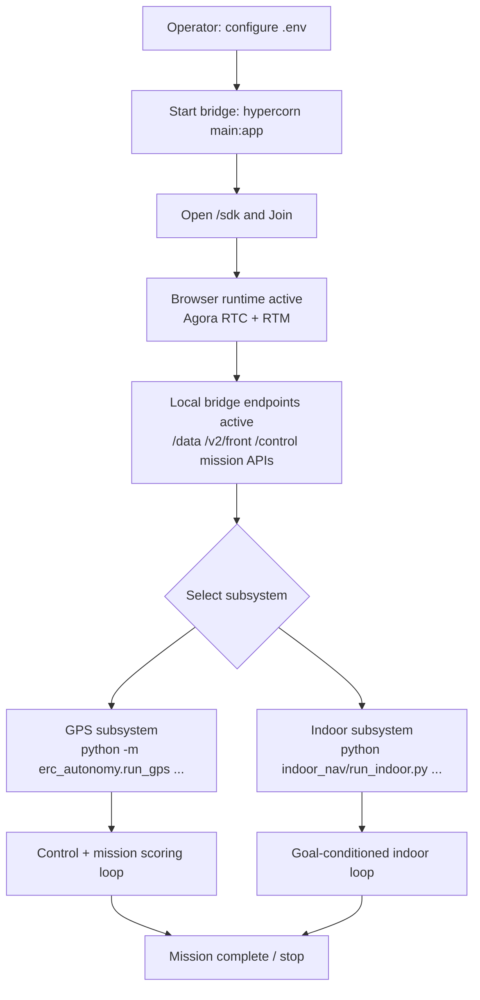
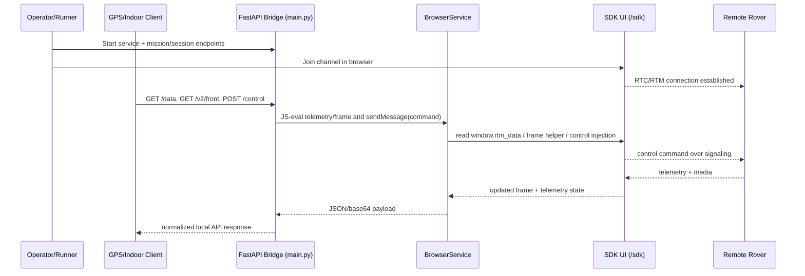
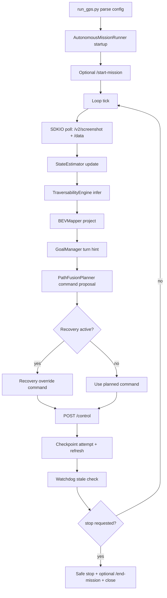
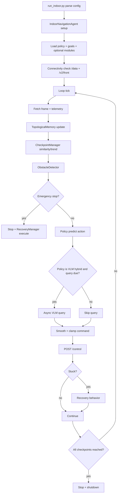

# NYU Earth Rover Technical Specification

Document status: Active
Last updated: 2026-03-05
Primary owners: NYU Earth Rover Team
Repository: `nyu-earthrover`

## 1. Purpose and Scope

This document defines the full technical specification for the NYU Earth Rover software stack in this repository. It is intended for:

- engineers implementing or modifying autonomy modules
- operators running missions in practice and competition settings
- reviewers evaluating architecture, safety, reliability, and model/tool choices

It covers:

- architecture and data/control flow
- subsystem-level design and interfaces
- endpoint contracts and mission lifecycle behavior
- algorithmic details (GPS and indoor autonomy)
- configuration surface and default values
- tooling and dependency rationale
- deployment, operations, validation, and known limitations

It does not cover:

- robot hardware internals outside SDK-exposed telemetry/control
- cloud infrastructure internals of FrodoBots/Agora backends
- legal/compliance policies for external services

## 2. System Context and Design Goals

### 2.1 Problem Context

The project controls a remote Earth Rover over networked infrastructure. The rover stream/control path depends on browser-side SDK runtime (video + RTM signaling), while autonomy code is Python-first. The system must remain safe under real-world uncertainty:

- variable network latency
- intermittent telemetry/frame freshness
- mission API errors
- model runtime failures

### 2.2 Core Goals

1. Provide a stable local control/sensing API for all higher-level modules.
2. Support two autonomy tracks in one repository:
   - GPS/checkpoint missions (`erc_autonomy`)
   - indoor image-goal navigation (`indoor_nav`)
3. Enforce safety-first behavior by default (stop on stale/uncertain states).
4. Allow incremental upgrades (model swaps, planner swaps, policy swaps) without rewriting the whole stack.
5. Preserve repeatability through explicit setup scripts, pinned deps where required, and test/CI gates.

### 2.3 Non-Goals

1. End-to-end policy-only control without explicit safety gates.
2. Tight coupling of autonomy code to provider-specific cloud/browser internals.
3. One-model-fits-all architecture for both GPS and indoor modes.

## 3. Repository Architecture

### 3.1 Top-Level Components

- `main.py`: local FastAPI bridge and mission/intervention API proxy
- `browser_service.py`: Playwright adapter for SDK browser runtime
- `static/`, `index.html`: web client runtime (Agora RTC/RTM + map)
- `erc_autonomy/`: modular GPS autonomy stack
- `indoor_nav/`: modular indoor autonomy stack
- `examples/`: teleop, logging, replay, analysis utilities
- `scripts/setup_sam2.sh`: reproducible SAM2 asset setup
- `.github/workflows/ci.yml`: CI safety gates

### 3.2 High-Level Runtime Diagram

```text
External clients (examples, GPS runner, indoor agent)
                    |
                    v
        Local SDK Bridge (FastAPI, main.py)
                    |
         +----------+----------+
         |                     |
         v                     v
 Browser runtime adapter   Mission/intervention proxy
 (Playwright, JS bridge)   (FrodoBots cloud HTTP APIs)
         |
         v
  SDK Web UI (/sdk, Agora RTC/RTM)
         |
         v
      Remote rover
```

### 3.3 Key Design Decision

All autonomy modules consume only local HTTP contracts (`/data`, `/v2/front`, `/control`, mission endpoints). They do not call cloud/stream internals directly. This reduces coupling and improves debuggability.

## 4. Control Plane and Data Plane Specification

### 4.1 Control Plane

Control commands are sent to local bridge endpoint:

- `POST /control`
- payload:

```json
{
  "command": {
    "linear": 0.0,
    "angular": 0.0,
    "lamp": 0
  }
}
```

`main.py` forwards command to browser runtime (`window.sendMessage(...)`) through `browser_service.send_message()`.

### 4.2 Data Plane

Telemetry and frames are exposed as local REST:

- `GET /data` -> latest telemetry snapshot (`window.rtm_data`)
- `GET /v2/front` -> front frame (base64)
- `GET /v2/rear` -> rear frame when available
- `GET /v2/screenshot` -> front (+rear for zero bot) with timestamp

Data path:

1. SDK web client receives peer messages (RTM) and updates `window.rtm_data`.
2. SDK web client exposes frame capture helper(s).
3. `browser_service.py` evaluates JS in page context to pull telemetry/frames.
4. `main.py` wraps response in local HTTP contract.

### 4.3 Mission Plane

Mission endpoints in local bridge proxy to FrodoBots API:

- `POST /start-mission`
- `POST /end-mission`
- `GET|POST /checkpoints-list`
- `POST /checkpoint-reached`
- `GET /missions-history`

Interventions:

- `POST /interventions/start`
- `POST /interventions/end`
- `GET /interventions/history`

### 4.4 Explicit Interface Invariants

To remove ambiguity, the following are hard interface rules in current implementation:

1. Command domain:
- `POST /control` expects `command.linear` and `command.angular` in `[-1.0, 1.0]`.
- SDK clients clamp values to this range before sending.

2. Frame payload format:
- `GET /v2/front`, `GET /v2/rear`, `GET /v2/screenshot` return raw base64 image payloads (no `data:image/...` prefix in JSON fields).
- `timestamp` fields in these endpoints are Unix epoch seconds (float).

3. Telemetry availability contract:
- `GET /data` returns `503` when telemetry is unavailable (`browser_service.data() is None`).
- Telemetry key presence/units are SDK-defined; consumers must handle missing keys defensively.

4. Mission guard behavior:
- When `MISSION_SLUG` is set, mission-guarded endpoints require successful mission start; otherwise request fails.
- `POST /checkpoint-reached` and intervention start/end return `503` if current telemetry does not provide usable lat/lon.

5. Rear camera semantics:
- Rear frames are not guaranteed for all bot types.
- `GET /v2/rear` returns `404` when no rear frame is available.
- `GET /v2/screenshot` includes rear only when bot type is `zero`.

6. Failure propagation:
- Bridge runtime failures (browser launch/join/eval failures) can surface as endpoint exceptions unless explicitly normalized.
- Cloud API transport failures in mission/intervention paths are normalized to error responses (`502` class behavior in hardened paths).

## 5. FastAPI Bridge Technical Specification (`main.py`)

### 5.1 Responsibilities

1. Load runtime environment and initialize service objects.
2. Manage auth/token and mission state transitions.
3. Serve SDK web UI routes (`/`, `/sdk`) and static assets.
4. Expose local control/sensing endpoints.
5. Proxy mission/intervention calls to external API.
6. Normalize and surface errors to callers.

### 5.2 Internal State

Global in-memory caches:

- `auth_response_data`: token/session metadata
- `checkpoints_list_data`: checkpoint list payload

Important consequence: state is process-local and resets when server restarts.

### 5.3 Endpoint Behavior Contract

#### 5.3.1 Sensing/Control

1. `POST /control`
- Preconditions: mission guard check (`need_start_mission`)
- Action: parse `command`, call `browser_service.send_message`
- Success: `200 {"message":"Command sent successfully"}`
- Failures: `400` malformed command, `500` runtime send failure

2. `GET /data`
- Preconditions: mission guard check
- Action: call `browser_service.data()`
- Success: telemetry JSON
- Failures: `503` if no telemetry payload; runtime exceptions can still bubble if browser init fails

3. `GET /v2/front`
- Action: call `browser_service.front()`
- Success: base64 frame + timestamp
- Failure: `404` if frame unavailable

4. `GET /v2/screenshot`
- Front always requested; rear included when `BOT_TYPE == "zero"`
- Returns available frames + timestamp
- Failure: `404` if no frame available

#### 5.3.2 Mission APIs

1. `POST /start-mission`
- Requires env vars: `SDK_API_TOKEN`, `BOT_SLUG`, `MISSION_SLUG`
- Loads auth/checkpoints on first call
- Returns mission start confirmation and checkpoints list

2. `POST /end-mission`
- Same required env vars
- Ends mission via cloud API and clears in-memory mission caches

3. `GET|POST /checkpoints-list`
- Requires mission started when `MISSION_SLUG` is set
- Returns cached/refreshed checkpoints payload

4. `POST /checkpoint-reached`
- Reads current lat/lon from local telemetry
- Proxies to cloud API
- Surfaces proximate distance on failure payload for downstream adaptation

#### 5.3.3 Intervention APIs

`/interventions/start` and `/interventions/end` use current telemetry lat/lon as payload context and proxy to cloud API.

### 5.4 Concurrency and Blocking Strategy

`requests` is synchronous, so cloud API calls are wrapped in `asyncio.to_thread(...)` to avoid blocking the FastAPI event loop.

### 5.5 CORS and External Access

CORS is configured as permissive (`*`) in current implementation. Suitable for local dev; production hardening should constrain origins/methods.

### 5.6 Complete Endpoint Status Matrix (Bridge)

The table below makes endpoint outcomes explicit for current `main.py` behavior.

| Endpoint | Method(s) | Success | Explicit failure codes | Notes |
|---|---|---|---|---|
| `/` | `GET` | `200` HTML | `400` (mission guard when `MISSION_SLUG` set and mission not started), `5xx` runtime | Spectator view render path |
| `/sdk` | `GET` | `200` HTML | `400` (mission guard), `5xx` runtime | Driver view render path |
| `/start-mission` | `POST` | `200` JSON | `400` missing env vars, propagated upstream `4xx/5xx`, `502` transport failures | Requires `SDK_API_TOKEN`, `BOT_SLUG`, `MISSION_SLUG` |
| `/end-mission` | `POST` | `200` JSON | `400` missing env vars, propagated upstream `4xx/5xx`, `502/500` failures | Clears in-memory auth/checkpoint caches on success |
| `/checkpoints-list` | `GET`, `POST` | `200` JSON | `400` mission guard, `500` missing auth/bot env, `502` transport, propagated upstream `4xx/5xx` | Returns/refreshes checkpoint list |
| `/control` | `POST` | `200` JSON | `400` missing command or mission guard, `500` send failure | Browser JS control path (`window.sendMessage`) |
| `/control-legacy` | `POST` | `200` JSON | `400` missing command or mission guard, `5xx` runtime | Direct Agora RTM legacy path |
| `/screenshot` | `GET` | `200` JSON | `400` invalid `view_types`, `500` file/read/runtime errors | Returns base64 screenshots from `screenshots/` |
| `/v2/screenshot` | `GET` | `200` JSON | `400` mission guard, `404` no frames, `5xx` runtime | Front always attempted; rear added for `BOT_TYPE=zero` |
| `/v2/front` | `GET` | `200` JSON | `400` mission guard, `404` frame unavailable, `5xx` runtime | Returns `front_frame` + timestamp |
| `/v2/rear` | `GET` | `200` JSON | `400` mission guard, `404` frame unavailable, `5xx` runtime | Rear may be unavailable for non-zero bots |
| `/data` | `GET` | `200` JSON | `400` mission guard, `503` telemetry unavailable, `5xx` runtime | Returns latest telemetry snapshot |
| `/checkpoint-reached` | `POST` | `200` JSON | `400` mission guard, `500` missing env vars, `503` missing lat/lon, `502` transport, propagated upstream `4xx/5xx` | Includes proximate distance detail on failure payload |
| `/missions-history` | `GET` | `200` JSON | propagated upstream `4xx/5xx`, `500` request exceptions | Uses cloud API history endpoint |
| `/interventions/start` | `POST` | `200` JSON | `400` mission guard, `500` missing env vars/request exceptions, `503` missing lat/lon, propagated upstream `4xx/5xx` | Includes `intervention_id` on success |
| `/interventions/end` | `POST` | `200` JSON | `400` mission guard, `500` missing env vars/request exceptions, `503` missing lat/lon, propagated upstream `4xx/5xx` | Ends active intervention |
| `/interventions/history` | `GET` | `200` JSON | `500` missing env vars/request exceptions, propagated upstream `4xx/5xx` | Cloud proxy endpoint |

## 6. Browser Runtime Adapter Specification (`browser_service.py`)

### 6.1 Responsibilities

1. Launch browser engine via Playwright.
2. Navigate to `/sdk`, click Join, wait for stream readiness.
3. Pull telemetry (`window.rtm_data`) and camera frames (JS helper functions).
4. Inject control commands via `window.sendMessage(...)`.
5. Optionally capture element screenshots (`front`, `rear`, `map`).

### 6.2 Startup Sequence

1. Start Playwright runtime.
2. Resolve browser engine (`webkit|chromium|firefox`).
3. Launch browser (headless optional).
4. Open page and navigate to `${SDK_BASE_URL}/sdk`.
5. Click `#join`.
6. Wait for RTC video availability and map DOM readiness.
7. Configure image format/quality in page context.

### 6.3 Runtime Configuration

- `BROWSER_ENGINE`
- `BROWSER_HEADLESS`
- `SDK_BASE_URL`
- `CHROME_EXECUTABLE_PATH` (chromium override)
- `IMAGE_FORMAT`
- `IMAGE_QUALITY`

### 6.4 Failure Modes

1. Browser launch failure or missing engine binary.
2. SDK page join timeout.
3. Video not ready, no frames available.
4. JS eval function errors.

The module closes browser resources on initialization failures, then re-raises.

## 7. Web Runtime and Signaling Integration

The SDK UI (served by `index.html` + `static/*`) integrates:

1. Agora RTC for media stream subscription.
2. Agora RTM for telemetry and command signaling.
3. In-page state (`window.rtm_data`) used by bridge telemetry endpoint.
4. Global command hook `window.sendMessage(...)` used by bridge control endpoint.

Telemetry freshness and frame availability are therefore tied to live SDK page session state.

## 8. GPS Autonomy Technical Specification (`erc_autonomy`)

### 8.1 Entry Point

`python -m erc_autonomy.run_gps`

`run_gps.py` loads `.env`, parses CLI/env-configured overrides, builds `ERCConfig`, and starts `AutonomousMissionRunner`.

### 8.2 Module Breakdown

1. `sdk_io.py`: async bridge client for `/data`, `/v2/screenshot`, `/control`, mission endpoints
2. `mission_fsm.py`: mission state transitions (`INIT -> STARTING -> RUNNING -> RECOVERING -> STOPPING -> STOPPED/ERROR`)
3. `watchdog.py`: stale sensor detector with rate-limited stale callback
4. `state_estimator.py`: filtered local pose from GPS/heading
5. `traversability.py`: `simple_edge` + optional SAM2 backend
6. `bev_mapper.py`: 2D traversability mask to BEV grid projection
7. `planner.py`: candidate arc rollout + top-k path fusion
8. `goal_manager.py`: checkpoint ingestion and heading turn hint
9. `recovery.py`: explicit stuck recovery finite-state behavior
10. `mission_runner.py`: orchestrates the control loop and subsystem interactions

### 8.3 Control Loop (Per Tick)

In `AutonomousMissionRunner.run()`:

1. Poll sensors (`sdk.poll()`): concurrent screenshot + telemetry.
2. Mark watchdog sensor freshness when packet arrives.
3. Update state estimate from telemetry.
4. Compute traversability from front frame.
5. Project traversability to BEV.
6. Compute goal hint from checkpoints + pose heading.
7. Plan command from BEV/traversability/goal hint.
8. Send command to `/control`.
9. Attempt checkpoint report when in threshold window.
10. Refresh checkpoints periodically.
11. Evaluate stale watchdog and recovery state.
12. Emit structured status logs every N ticks.

### 8.4 Estimator Model

`state_estimator.py` uses lightweight exponential filtering and GPS jump rejection:

- Local ENU conversion from GPS lat/lon relative to first valid origin.
- Position update accepted if jump <= `max_gps_jump_m`.
- Heading blend with angle wrap-aware interpolation.
- Speed blend via EMA.

Designed as replaceable scaffold (future EKF/UKF) while keeping interface stable.

### 8.5 Traversability Backends

#### 8.5.1 `simple_edge` (default)

- grayscale + blur + Canny edge density in near field
- edge occupancy transformed to traversability confidence/risk
- produces soft traversability mask and left/center/right clearances

#### 8.5.2 `sam2` (optional)

- builds SAM2 automatic mask generator with configurable thresholds
- selects traversable region via ROI overlap and near-field support heuristics
- merges compatible masks, smooths mask, computes confidence summary
- if SAM2 config/checkpoint/import/inference fails, falls back to `simple_edge`

SAM2 is configured by:

- `SAM2_MODEL_CFG`
- `SAM2_CHECKPOINT`
- `SAM2_DEVICE`
- threshold/tuning env vars

Provisioning and checks:

- `scripts/setup_sam2.sh`
- `python -m erc_autonomy.check_sam2 [--probe-load]`

### 8.6 BEV Mapping Model

`bev_mapper.py` uses a lightweight monotonic projection:

1. crop lower image ROI
2. resize into fixed BEV raster (`depth_cells x width_cells`)
3. apply row weighting (near field emphasized)
4. compute cost map (`1 - traversability`)
5. summarize left/center/right BEV scores

This is a pragmatic geometric proxy and intended upgrade point for calibrated perspective projection.

### 8.7 Planner Model

`planner.py` generates arc rollouts across sampled curvatures and scores each candidate using:

```text
score = w_mean * mean_trav
      + w_min  * min_trav
      + w_goal * goal_alignment
      - w_curv * curvature_penalty
```

Then:

1. sort by score
2. fuse top-k paths via softmax weights
3. derive `speed_hint`, `angular_hint`, and `mode` (`drive|stop`)

This keeps local planning deterministic, inspectable, and inexpensive.

### 8.8 Goal/Checkpoint Guidance

`goal_manager.py`:

1. parses checkpoint list payload
2. tracks active sequence
3. computes target bearing and heading error
4. emits normalized turn hint in `[-1, 1]`

Distance is computed with haversine; turn hint is heading error normalized by pi.

### 8.9 Safety and Recovery

#### 8.9.1 Stale Sensor Watchdog

- stale trigger threshold from `stale_sensor_ms`
- callback issues repeated safe-stop commands
- trigger is rate-limited to avoid control spam

#### 8.9.2 Recovery Behavior

Recovery mode transitions:

- `idle -> backtrack -> rotate -> pause -> idle`

Activation conditions:

1. commanded motion exists
2. measured speed remains below threshold
3. traversability confidence above floor
4. stuck duration exceeds timeout and cooldown constraints

The manager alternates rotate direction between recoveries and can bias first rotate sign with goal turn hint.

### 8.10 GPS Configuration Surface (Defaults)

Source: `erc_autonomy/config.py`

- loop and freshness: `loop_hz=10`, `request_timeout_s=3.0`, `stale_sensor_ms=1200`
- safety: `enable_motion=False`, `max_linear=0.25`, `max_angular=0.4`
- estimator: `position_alpha=0.35`, `yaw_alpha=0.25`, `speed_alpha=0.4`
- traversability: backend default `simple_edge`, SAM2 fields empty by default
- planner: 11 curvatures, 2.8m horizon, top-k fusion = 3
- checkpoint behavior: auto report enabled, speed/turn taper and failure-aware modulation
- recovery behavior enabled with conservative defaults

## 9. Indoor Autonomy Technical Specification (`indoor_nav`)

### 9.1 Entry Point

`python indoor_nav/run_indoor.py --goals <...> --policy <backend>`

### 9.2 Agent Architecture

Core orchestrator: `indoor_nav/agent.py`

Per-tick flow at configured control rate:

1. fetch front frame + telemetry concurrently
2. update topological memory
3. compute goal similarity and trend
4. detect obstacles
5. query policy backend for action
6. smooth and clamp command
7. send control
8. check stuck and trigger recovery
9. log payload/control at configured logging rate

### 9.3 Indoor Module Specifications

#### 9.3.1 SDK Client (`modules/sdk_client.py`)

- async `aiohttp` client
- typed `BotState` dataclass
- base64 image decoding to OpenCV BGR arrays
- local endpoint wrappers for mission/control/data/frames

#### 9.3.2 Checkpoint Manager (`modules/checkpoint_manager.py`)

Supported match methods:

- `dinov2_vlad`
- `dinov3_vlad`
- `siglip2`
- `dinov2`
- `eigenplaces`
- `clip`
- `sift`

Primary pipeline (`dinov2_vlad`/`dinov3_vlad`):

1. extract patch tokens
2. normalize
3. aggregate with VLAD clusters
4. compute cosine similarity against goal descriptors
5. apply arrival threshold + patience logic

#### 9.3.3 Obstacle Detector (`modules/obstacle_avoidance.py`)

Backends:

- `depth_anything` (default)
- `depth_pro`
- `simple_edge` fallback

Outputs each frame:

- `speed_factor`
- `steer_bias`
- `emergency_stop`
- left/center/right clearances
- narrow-passage flag

Includes temporal smoothing and near/mid-field occupancy modeling.

#### 9.3.4 Topological Memory (`modules/topological_memory.py`)

- node graph with visual descriptors
- edge costs from traversal time
- optional loop closure based on descriptor similarity
- A* path planning over graph connectivity
- frontier/dead-end utilities for exploration and backtracking

#### 9.3.5 Recovery Manager (`modules/recovery.py`)

Escalating behavior sequence from config (example defaults):

- back up
- random turn
- wall follow
- full rotation scan

#### 9.3.6 Policy Backends

1. `vlm_hybrid_policy.py`
- low-frequency VLM reasoning + high-frequency reactive control
- supports OpenAI-compatible, Ollama, and Anthropic-style API payloads
- produces structured instruction mapped to command priors

2. `vla_policy.py`
- direct action policy path (OpenVLA backend integration when available)
- includes enhanced heuristic fallback with visual servoing/exploration

3. `nomad_policy.py`
- NoMaD/ViNT style goal-conditioned path with heuristic fallback if model unavailable

### 9.4 Indoor Configuration Surface (Defaults)

Source: `indoor_nav/configs/config.py`

Important defaults:

- SDK base URL `http://127.0.0.1:8000`
- control loop `10 Hz`
- default policy backend `vlm_hybrid`
- default goal matching `dinov2_vlad`
- obstacle backend `depth_anything`
- topological memory enabled
- logging enabled (`indoor_nav/logs`)

## 10. Local API Surface Summary

### 10.1 Utility and UI

- `GET /`
- `GET /sdk`
- `GET /docs`
- `GET /openapi.json`

### 10.2 Sensing and Control

- `POST /control`
- `POST /control-legacy`
- `GET /data`
- `GET /screenshot`
- `GET /v2/screenshot`
- `GET /v2/front`
- `GET /v2/rear`

### 10.3 Mission

- `POST /start-mission`
- `POST /end-mission`
- `GET|POST /checkpoints-list`
- `POST /checkpoint-reached`
- `GET /missions-history`

### 10.4 Interventions

- `POST /interventions/start`
- `POST /interventions/end`
- `GET /interventions/history`

## 11. Data Logging and Offline Analysis Specification

### 11.1 Logging format

`examples/utils/data_logger.py` stores HDF5 with datasets/groups:

- `telemetry(timestamp,battery,signal_level,orientation,lamp,speed,gps_signal,latitude,longitude,vibration)`
- `accels(x,y,z,t)`
- `gyros(x,y,z,t)`
- `mags(x,y,z,t)`
- `rpms(front_left,front_right,rear_left,rear_right,t)`
- `controls(timestamp,linear,angular)`
- `front_frames/{timestamps,data}`
- `rear_frames/{timestamps,data}`

Frames are stored as variable-length encoded bytes to preserve codec format and reduce decode overhead during logging.

### 11.2 Analysis

`examples/utils/analyze_log.py` provides quick diagnostics and plot generation (telemetry trends, path, IMU, RPM, control timeline, sample frames).

## 12. Configuration and Environment Specification

### 12.1 Required Core Variables

- `SDK_API_TOKEN`
- `BOT_SLUG`
- `MISSION_SLUG` (required only for scored mission workflows)

### 12.2 Browser Runtime Variables

- `BROWSER_ENGINE`
- `BROWSER_HEADLESS`
- `SDK_BASE_URL`
- `CHROME_EXECUTABLE_PATH` (chromium only)
- `IMAGE_FORMAT`
- `IMAGE_QUALITY`

### 12.3 SAM2 Variables

- `SAM2_MODEL_CFG`
- `SAM2_CHECKPOINT`
- `SAM2_DEVICE`
- `SAM2_MAX_SIDE`
- `SAM2_POINTS_PER_SIDE`
- `SAM2_PRED_IOU_THRESH`
- `SAM2_STABILITY_SCORE_THRESH`
- `SAM2_MIN_MASK_REGION_AREA`

### 12.4 Configuration Precedence and Parsing Rules

The project uses multiple config entry points. Precedence is explicit:

1. `main.py` / `browser_service.py` runtime:
- Environment-driven.
- `.env` is loaded via `python-dotenv` with non-overriding behavior (`override=False`), so already-exported shell vars win over `.env` file values.

2. `erc_autonomy.run_gps`:
- `.env` is loaded first (`override=False`).
- CLI args are parsed next.
- For SAM2 fields, precedence is:
  - CLI flag value
  - environment variable (`SAM2_*`)
  - built-in default
- For non-SAM2 GPS fields, precedence is:
  - CLI flag value
  - built-in default
- Invalid numeric env values for SAM2 fields are parsed defensively and fall back to built-in defaults.

3. `indoor_nav.run_indoor.py`:
- Configuration is CLI-first (no implicit `.env` config layer in this entry point).
- If `--vlm-endpoint` is empty, `vlm_hybrid` policy runs reactive control without remote VLM queries.

### 12.5 Optional Feature Activation Rules (Explicit)

Optional capabilities are enabled only under these conditions:

1. GPS motion output:
- Disabled by default.
- Enabled only when `--enable-motion` is passed to `erc_autonomy.run_gps`.

2. GPS SAM2 traversability backend:
- Selected only when `--traversability-backend sam2` is set.
- Requires readable `SAM2_MODEL_CFG` and `SAM2_CHECKPOINT` plus importable SAM2 runtime.
- If any SAM2 precondition fails at init or inference, runtime falls back to `simple_edge` backend.

3. Indoor DINOv3-VLAD:
- Used only when `--match-method dinov3_vlad` is selected.
- Requires model availability/access through the configured Transformers path.
- Not the default matcher; default remains `dinov2_vlad`.

4. Indoor OpenVLA backend:
- Selected when policy backend is `vla` and VLA backend resolves to OpenVLA.
- If model load fails, policy falls back to heuristic-plus behavior.

5. Indoor VLM calls:
- `vlm_hybrid` performs remote VLM API calls only when `vlm_endpoint` is configured.
- Without endpoint, control remains local/reactive and no remote reasoning call is attempted.

### 12.6 Bot-Type Compatibility Matrix

| Capability | Mini bot | Zero bot | Notes |
|---|---|---|---|
| `GET /v2/front` | supported | supported | Primary camera stream |
| `GET /v2/rear` | typically unavailable (`404` when missing) | supported when stream exists | Runtime returns `404` if frame absent |
| `GET /v2/screenshot` rear field | omitted | included | Rear frame inclusion is bot-type gated (`zero`) |
| GPS autonomy (`erc_autonomy`) | supported | supported | Uses front frame + telemetry |
| Indoor autonomy (`indoor_nav`) | supported | supported | Rear use is optional/configured |

### 12.7 Security and Trust Boundaries (Current State)

1. Trust boundary:
- Autonomy modules trust the local bridge (`main.py`) as source of truth for telemetry/frames/control.
- Bridge trusts SDK browser runtime JS state (`window.rtm_data`, frame helpers).

2. Credentials:
- SDK tokens are expected via env variables; they are not persisted by this codebase.
- Operators are responsible for secure local env handling.

3. CORS posture:
- CORS is permissive (`*`) for current local-dev workflows.
- This is not a hardened production posture.

4. External dependencies:
- Mission/intervention APIs depend on external FrodoBots cloud availability.
- Media/signaling path depends on Agora runtime in SDK UI session.

### 12.8 Units, Ranges, and Type Contracts

This section makes data semantics explicit where implementation depends on unit assumptions.

| Field / signal | Type | Units / range | Source of truth |
|---|---|---|---|
| `command.linear` | float | normalized command in `[-1.0, 1.0]` | Bridge/API contract (`/control`) |
| `command.angular` | float | normalized command in `[-1.0, 1.0]` | Bridge/API contract (`/control`) |
| `command.lamp` | int | `{0,1}` semantic in current usage | Bridge/API contract |
| `timestamp` in `/v2/*` and `/data` payloads | float | Unix epoch seconds | SDK/bridge runtime payload |
| `orientation` telemetry | float | degrees (consumed as degrees, converted to radians in GPS estimator) | SDK telemetry payload |
| `latitude`, `longitude` telemetry | float | decimal degrees | SDK telemetry payload |
| `source_latency_ms` (`erc_autonomy.SensorPacket`) | float | milliseconds | computed in `erc_autonomy/sdk_io.py` |
| `StateEstimate.x_m`, `y_m` | float | meters in local ENU frame | computed in `erc_autonomy/state_estimator.py` |
| `StateEstimate.yaw_rad` | float | radians | computed in `erc_autonomy/state_estimator.py` |
| `StateEstimate.speed_mps` | float | treated as m/s by estimator and recovery logic | mapped from SDK `speed` telemetry field |
| `goal_turn_hint` | float | normalized `[-1,1]` (bearing error / pi) | `erc_autonomy/goal_manager.py` |
| `goal_similarity` (indoor) | float | normalized similarity score in `[0,1]` by matcher logic | `indoor_nav/modules/checkpoint_manager.py` |
| `PolicyOutput.linear/angular` (indoor) | float | normalized command in `[-1,1]` | `indoor_nav/policies/base_policy.py` |
| `ObstacleInfo.speed_factor` | float | multiplier in `[0,1]` | `indoor_nav/modules/obstacle_avoidance.py` |
| `ObstacleInfo.steer_bias` | float | additive steering bias in `[-1,1]` expected domain | `indoor_nav/modules/obstacle_avoidance.py` |

## 13. Dependency and Tooling Specification

Base runtime (`requirements.txt`):

- FastAPI, Hypercorn, Pydantic
- Playwright, python-dotenv
- requests, aiohttp
- OpenCV, NumPy
- pynput, h5py, matplotlib

Optional SAM2 runtime (`erc_autonomy/requirements_sam2.txt`):

- pinned SAM2 source install at commit `2b90b9f5ceec907a1c18123530e92e794ad901a4`
- `pycocotools`

Optional indoor extras (`indoor_nav/requirements_indoor.txt`):

- torch, torchvision, transformers
- optional VLM serving/client stacks (vLLM/openai/ollama)
- Pillow, scipy

### 13.1 Why these tools are used

The tooling matrix below gives the implementation-level answer for each major tool: what it is, where it is used, how it is used in this repo, why it was chosen, and supporting references.

### 13.2 Tooling Matrix

| Tool | Upstream Status | What | Where | How | Rationale | Supporting references |
|---|---|---|---|---|---|---|
| FastAPI | In upstream | ASGI web framework for local bridge APIs | `main.py` | Defines async REST endpoints for control/data/mission/intervention flows | Keeps a stable local contract for all autonomy clients | https://fastapi.tiangolo.com/ |
| Hypercorn | In upstream | ASGI application server | `Dockerfile`, local runbook in Section 14 | Serves `main:app` for local and container runtime | Production-capable async serving for FastAPI app | https://hypercorn.readthedocs.io/en/latest/index.html |
| Pydantic | In upstream | Data validation/modeling | `main.py` | Validates request/response payload models at API boundary | Reduces malformed payload errors and keeps API contracts explicit | https://docs.pydantic.dev/latest/ |
| Playwright | In upstream | Browser automation runtime | `browser_service.py` | Launches browser engine, joins `/sdk`, captures frames/telemetry, injects controls via JS bridge | SDK media/signaling is browser-native; automation is required for bridge operation | https://playwright.dev/python/docs/intro |
| python-dotenv | In upstream | `.env` loader | `browser_service.py`, `erc_autonomy/run_gps.py`, `erc_autonomy/check_sam2.py` | Loads env vars with safe defaults before runtime init | Consistent local configuration across scripts and services | https://pypi.org/project/python-dotenv/ |
| requests | In upstream | Sync HTTP client | `main.py` | Calls cloud mission/intervention APIs via `asyncio.to_thread(...)` wrappers | Mature HTTP client for low-rate cloud API calls while preserving FastAPI loop responsiveness | https://requests.readthedocs.io/en/latest/ |
| aiohttp | In upstream | Async HTTP client | `erc_autonomy/sdk_io.py`, `indoor_nav/modules/sdk_client.py` | High-frequency non-blocking polling/control and mission calls | Required for 10 Hz class control loops without blocking | https://docs.aiohttp.org/en/stable/ |
| OpenCV | In upstream | Computer vision primitives | `erc_autonomy/traversability.py`, `indoor_nav/modules/obstacle_avoidance.py`, image decode paths | Canny/blur/morphology/resize/decode for frame processing and safety signals | Fast, inspectable CV building blocks with broad ecosystem support | https://docs.opencv.org/4.x/ |
| NumPy | In upstream | Numeric array compute | `erc_autonomy/*`, `indoor_nav/*` modules | Vectorized scoring, filtering, cost/traversability calculations | Simple, deterministic numerical core for planning/perception logic | https://numpy.org/doc/stable/ |
| pynput | In upstream | Keyboard input capture utility | `examples/utils/keyboard_control.py` | Reads local keyboard events for teleoperation controls | Lightweight teleop/debug path during data collection and SDK validation | https://pypi.org/project/pynput/ |
| h5py | In upstream | HDF5 logging backend | `examples/utils/data_logger.py`, `indoor_nav/agent.py` logger integration | Stores telemetry/controls/frames in structured experiment logs | Enables repeatable offline analysis and debugging | https://docs.h5py.org/en/stable/ |
| Matplotlib | In upstream | Plotting/analysis | `examples/utils/analyze_log.py` | Produces telemetry/path/control plots from HDF5 logs | Fast tuning loop from recorded runs to parameter updates | https://matplotlib.org/stable/ |
| PyTorch | Newly added | Deep learning runtime | `indoor_nav/policies/*`, `indoor_nav/modules/checkpoint_manager.py`, optional SAM2 path | Loads and runs model inference for VPR/VLM/VLA/depth components | De facto runtime for modern model ecosystems used by this stack | https://pytorch.org/docs/stable/ |
| Torchvision | Newly added | Vision model/data utilities for PyTorch stack | `indoor_nav/policies/vla_policy.py`, optional model paths | Pre/post transforms and model interoperability for vision backends | Standard companion library for PyTorch vision workflows | https://pytorch.org/vision/stable/index.html |
| Transformers | Newly added | Model loading/inference interfaces | `indoor_nav/modules/checkpoint_manager.py`, `indoor_nav/policies/*`, obstacle models | Uses pretrained HF models for feature extraction and policy backends | Unifies model integration and reduces custom model plumbing | https://huggingface.co/docs/transformers/index |
| Pillow | Newly added | Image conversion utility for model inference | `indoor_nav/modules/checkpoint_manager.py`, `indoor_nav/policies/*`, obstacle model wrappers | Converts OpenCV BGR arrays to PIL format required by many model processors | Compatibility layer between CV pipeline and model runtimes | https://pillow.readthedocs.io/ |
| SciPy | Newly added | Scientific compute utilities (optional indoor extras) | `indoor_nav/requirements_indoor.txt` | Available for advanced matching/filtering/statistical utilities when needed | Supports algorithm experimentation without custom numeric reimplementation | https://docs.scipy.org/doc/scipy/ |
| Agora RTC Web SDK | In upstream | Browser media transport runtime | `static/AgoraRTC_N-4.24.2.js`, `static/basicVideoCall.js`, `index.html` | Joins video channel and provides camera stream playback in SDK UI | Required media layer for rover stream path used by bridge capture | https://api-ref.agora.io/en/video-sdk/web/4.x/index.html |
| Agora RTM / Signaling SDK | In upstream | Browser telemetry/command signaling runtime | `static/agora-rtm-sdk-1.5.1.js`, `static/basicRtm.js`, `index.html` | Exchanges telemetry and command messages in SDK UI session | Required signaling path backing `/data` and command injection | https://api-ref.agora.io/en/signaling-sdk/web/1.x/index.html |
| Leaflet | In upstream | Web map rendering library | `index.html`, `static/map.js` | Renders map and checkpoints in SDK UI | Provides geospatial context to operators and browser runtime | https://leafletjs.com/ |
| VLM-Hybrid Policy | Newly added | Hierarchical policy that combines low-rate VLM reasoning with high-rate reactive control | `indoor_nav/policies/vlm_hybrid_policy.py`, `indoor_nav/agent.py`, `indoor_nav/run_indoor.py` | Periodically queries a VLM with current/goal images, parses structured instruction, and blends it with obstacle/reactive control at loop rate | Keeps semantic navigation behavior without giving direct low-level control to an LLM | https://arxiv.org/abs/2502.13923 , https://arxiv.org/abs/2407.07775 |
| Qwen2.5-VL | Newly added | Default VLM model target for indoor `vlm_hybrid` mode | `indoor_nav/configs/config.py`, `indoor_nav/run_indoor.py` | Used as default `vlm_model` (`Qwen/Qwen2.5-VL-7B-Instruct`) through OpenAI-compatible payload format | Strong open VLM baseline with multimodal support and structured outputs | https://arxiv.org/abs/2502.13923 |
| VLM API Protocol Adapters | Newly added | Provider protocol layer for VLM requests | `indoor_nav/policies/vlm_hybrid_policy.py` | Supports OpenAI-compatible chat completions, Ollama generate API, and Anthropic messages API | Decouples policy logic from provider-specific request/response formats | https://platform.openai.com/docs/api-reference/chat/create , https://docs.ollama.com/api , https://docs.anthropic.com/en/api/messages |
| vLLM (optional) | Newly added | Local/remote OpenAI-compatible inference serving stack for VLMs | `indoor_nav/requirements_indoor.txt` (optional dependency path), `indoor_nav/run_indoor.py` endpoint config | Serves multimodal models behind OpenAI-compatible endpoint consumed by `vlm_hybrid_policy.py` | Allows local controllable VLM inference without hard provider lock-in | https://docs.vllm.ai/en/latest/ |
| DINOv2-VLAD | Newly added | Visual place-recognition matcher (indoor goal matching baseline) | `indoor_nav/modules/checkpoint_manager.py`, `indoor_nav/configs/config.py`, `indoor_nav/run_indoor.py` | Extracts DINOv2 patch tokens and aggregates with VLAD for goal-image similarity scoring | Strong recall/robustness baseline for image-goal checkpointing | https://arxiv.org/abs/2304.07193 , https://arxiv.org/abs/2308.00688 , https://arxiv.org/abs/2309.16588 |
| DINOv3-VLAD | Newly added | Optional visual place-recognition matcher (A/B toggle) | `indoor_nav/modules/checkpoint_manager.py`, `indoor_nav/configs/config.py`, `indoor_nav/eval_match_ab.py`, `indoor_nav/run_indoor.py` | Uses DINOv3 features with the same VLAD pipeline and is evaluated against DINOv2-VLAD via `eval_match_ab.py` | Controlled upgrade path: benchmark newer representation before changing defaults | https://arxiv.org/abs/2508.10104 |
| SAM2 | Newly added | Foundation segmentation model (optional traversability backend) | `erc_autonomy/traversability.py`, `scripts/setup_sam2.sh`, `erc_autonomy/check_sam2.py`, `erc_autonomy/bench_traversability.py` | Builds automatic mask generator from pinned config/checkpoint and converts masks to traversability | Higher-capability optional backend with explicit fallback to baseline when unavailable | https://github.com/facebookresearch/sam2 , https://arxiv.org/abs/2408.00714 |
| pycocotools | Newly added | COCO mask utilities | `erc_autonomy/traversability.py` | Decodes compressed RLE masks returned by some SAM2 builds | Keeps compatibility across SAM2 output formats | https://github.com/cocodataset/cocoapi |
| GitHub Actions | Newly added | CI automation | `.github/workflows/ci.yml` | Runs compile, fallback unit test, and CLI smoke checks on push/PR | Early regression detection for critical runtime paths | https://docs.github.com/actions |

### 13.3 Complete Backend Enumeration (Implemented Choices)

This section enumerates all backend switches currently implemented in code paths.

1. GPS traversability backend (`erc_autonomy.run_gps --traversability-backend`):
- `simple_edge`
- `sam2`

2. GPS SAM2 device selector (`erc_autonomy.run_gps --sam2-device`):
- `auto`
- `cpu`
- `cuda`
- `mps`

3. Indoor policy backend (`indoor_nav.run_indoor.py --policy`):
- `nomad`
- `vint`
- `vlm_hybrid`
- `vla`
- `heuristic`

4. Indoor goal matching backend (`indoor_nav.run_indoor.py --match-method`):
- `dinov2_vlad`
- `dinov3_vlad`
- `siglip2`
- `dinov2`
- `eigenplaces`
- `clip`
- `sift`

5. Indoor obstacle backend (`indoor_nav.run_indoor.py --obstacle-method`):
- `depth_anything`
- `depth_pro`
- `simple_edge`

6. Indoor VLM API payload format (`PolicyConfig.vlm_api_format` and auto-detect logic):
- `openai`
- `ollama`
- `anthropic`

7. Indoor VLA backend (`PolicyConfig.vla_backend`):
- `openvla`
- `octo`
- `heuristic_plus`

8. Indoor topological feature method (`TopoMemoryConfig.feature_method`):
- `histogram`
- `dinov2` (placeholder path in current implementation)

### 13.4 Default Selection and Fallback Behavior (Explicit)

1. GPS defaults:
- Traversability backend default is `simple_edge`.
- `sam2` is opt-in and falls back to `simple_edge` on missing assets/import/build/inference failures.

2. Indoor defaults:
- Policy backend default is `vlm_hybrid`.
- Goal matcher default is `dinov2_vlad`.
- Obstacle backend default is `depth_anything`.

3. Fallback examples:
- `vla` path falls back to heuristic-plus when model load fails.
- `nomad`/`vint` paths fall back to heuristic behavior when model unavailable.
- `vlm_hybrid` runs without remote VLM calls when endpoint is unset.
- `depth_pro` path falls back to `depth_anything` when unavailable.

## 14. Deployment and Operations

### 14.1 Local Development Runbook

1. Create env and install deps:

```bash
conda create -n erv python=3.11
conda activate erv
pip install -r requirements.txt
```

2. Configure runtime:

```bash
cp .env.sample .env
```

3. Start bridge:

```bash
hypercorn main:app --reload
```

4. Open `http://localhost:8000`, click Join.

5. Validate:

```bash
curl http://127.0.0.1:8000/openapi.json
curl http://127.0.0.1:8000/data
curl http://127.0.0.1:8000/v2/front
```

### 14.2 Docker Runtime

Docker image installs base requirements and Playwright webkit dependency, then runs:

```bash
hypercorn main:app --bind 0.0.0.0:8000
```

Compose file maps port `8000:8000` and sets baseline env values.

### 14.3 SAM2 Provisioning Runbook

```bash
pip install -r erc_autonomy/requirements_sam2.txt
scripts/setup_sam2.sh --variant sam2.1_hiera_large
python -m erc_autonomy.check_sam2 --probe-load
```

Example GPS run with SAM2:

```bash
python -m erc_autonomy.run_gps \
  --traversability-backend sam2 \
  --sam2-model-cfg configs/sam2.1/sam2.1_hiera_l.yaml \
  --sam2-checkpoint .models/sam2/checkpoints/sam2.1_hiera_large.pt
```

## 15. Validation, Testing, and CI

### 15.1 CI Safety Gates (`.github/workflows/ci.yml`)

On push/PR:

1. install deps
2. compile Python sources (`compileall`)
3. run fallback regression tests:
   - `erc_autonomy.tests.test_traversability_fallback`
4. run CLI smoke checks:
   - `run_gps --help`
   - `bench_traversability --help`
   - `check_sam2 --help`

### 15.2 Manual Runtime Checks

1. API liveness:

```bash
curl http://127.0.0.1:8000/openapi.json
```

2. data/frames/control:

```bash
curl http://127.0.0.1:8000/data
curl http://127.0.0.1:8000/v2/front
curl -X POST http://127.0.0.1:8000/control \
  -H 'Content-Type: application/json' \
  -d '{"command":{"linear":0,"angular":0}}'
```

3. SAM2 preflight:

```bash
python -m erc_autonomy.check_sam2
```

## 16. Reliability, Safety, and Risk Register

### 16.1 Safety Mechanisms Present

1. Motion disabled by default in GPS autonomy.
2. Stale sensor watchdog issues repeated safe-stop.
3. Low-confidence traversability gating to stop/slow behavior.
4. Explicit recovery FSM rather than uncontrolled command escalation.
5. Command clipping/rate limiting in SDK clients.

### 16.2 Known Operational Risks

1. Stream/session readiness can block or fail frame/telemetry paths.
2. Bridge state caches are in-memory only (no persistence across restarts).
3. Mission-scored mode requires strict env setup (`MISSION_SLUG` etc).
4. Heavy indoor model stacks may exceed resource budgets on weak hardware.
5. Some policy backends are optional/fallback-first depending on model availability.

### 16.3 Recommended Hardening Next

1. Add explicit startup/readiness endpoint for browser stream status.
2. Add endpoint-level timeout guards around browser init-dependent calls.
3. Persist mission/auth cache state or expose clear reset semantics.
4. Expand formal tests for mission/intervention and stream-loss edge cases.
5. Add benchmark baselines for indoor policy/matcher/obstacle modules.

## 17. Technical References

### 17.1 Core Platform and Libraries

1. FastAPI docs: https://fastapi.tiangolo.com/
2. Hypercorn docs: https://hypercorn.readthedocs.io/en/latest/index.html
3. Playwright for Python: https://playwright.dev/python/docs/intro
4. aiohttp docs: https://docs.aiohttp.org/en/stable/
5. Pydantic docs: https://docs.pydantic.dev/latest/
6. Requests docs: https://requests.readthedocs.io/en/latest/
7. NumPy docs: https://numpy.org/doc/stable/
8. OpenCV docs: https://docs.opencv.org/4.x/
9. h5py docs: https://docs.h5py.org/en/stable/
10. Matplotlib docs: https://matplotlib.org/stable/
11. PyTorch docs: https://pytorch.org/docs/stable/
12. Torchvision docs: https://pytorch.org/vision/stable/index.html
13. Hugging Face Transformers docs: https://huggingface.co/docs/transformers/index
14. python-dotenv: https://pypi.org/project/python-dotenv/
15. SAM2 repository: https://github.com/facebookresearch/sam2
16. COCO API / pycocotools: https://github.com/cocodataset/cocoapi
17. vLLM docs: https://docs.vllm.ai/en/latest/
18. OpenAI Chat Completions API: https://platform.openai.com/docs/api-reference/chat/create
19. Ollama API: https://docs.ollama.com/api
20. Anthropic Messages API: https://docs.anthropic.com/en/api/messages
21. Leaflet docs: https://leafletjs.com/
22. HDF5 docs (The HDF Group): https://docs.hdfgroup.org/
23. Agora Video SDK Web API reference: https://api-ref.agora.io/en/video-sdk/web/4.x/index.html
24. Agora Signaling SDK Web API reference: https://api-ref.agora.io/en/signaling-sdk/web/1.x/index.html

### 17.2 Research References Used in the Stack

1. Oquab et al., DINOv2, arXiv:2304.07193
2. Darcet et al., Vision Transformers Need Registers, arXiv:2309.16588
3. Keetha et al., AnyLoc, arXiv:2308.00688
4. Tschannen et al., SigLIP 2, arXiv:2502.14786
5. Berton et al., EigenPlaces, arXiv:2308.10832
6. Bai et al., Qwen2.5-VL, arXiv:2502.13923
7. Yang et al., Depth Anything V2, arXiv:2406.09414
8. Bochkovskii et al., Depth Pro, arXiv:2410.02073
9. Sridhar et al., NoMaD, arXiv:2310.07896
10. Shah et al., ViNT, arXiv:2306.14846
11. Kim et al., OpenVLA, arXiv:2406.09246
12. Open X-Embodiment Collaboration, arXiv:2310.08864
13. Ravi et al., SAM 2, arXiv:2408.00714

## 18. Change Control

When updating this document:

1. keep implementation claims aligned with current code paths
2. update default values if config dataclasses/CLI defaults change
3. update reference links if upstream docs move
4. include migration notes for breaking API or behavior changes


## 19. Appendix A: Configuration Defaults (Implementation Reference)

This appendix mirrors current dataclass defaults so operators and developers can audit runtime behavior quickly.

### 19.1 `ERCConfig` Defaults (`erc_autonomy/config.py`)

| Key | Default | Purpose |
|---|---:|---|
| `base_url` | `http://127.0.0.1:8000` | Local SDK bridge base URL |
| `loop_hz` | `10.0` | GPS control loop rate |
| `log_every_n_ticks` | `20` | Structured status logging period |
| `request_timeout_s` | `3.0` | HTTP timeout for SDKIO |
| `stale_sensor_ms` | `1200` | Stale watchdog threshold |
| `min_command_hz` | `10.0` | Soft command burst limiter |
| `start_mission_on_boot` | `False` | Auto-call `/start-mission` at runner startup |
| `end_mission_on_shutdown` | `False` | Auto-call `/end-mission` at shutdown |
| `stop_duration_s` | `0.8` | Safe-stop pulse duration |
| `stop_hz` | `20.0` | Safe-stop pulse frequency |
| `position_alpha` | `0.35` | Position EMA gain |
| `yaw_alpha` | `0.25` | Yaw EMA gain |
| `speed_alpha` | `0.4` | Speed EMA gain |
| `max_gps_jump_m` | `20.0` | GPS jump rejection threshold |
| `enable_motion` | `False` | Motion safety gate |
| `max_linear` | `0.25` | Max linear speed command |
| `max_angular` | `0.4` | Max angular speed command |
| `reactive_turn_gain` | `0.8` | Reactive turn scale |
| `traversability_confidence_floor` | `0.25` | Confidence gate before movement |
| `traversability_backend` | `simple_edge` | Traversability backend selector |
| `sam2_model_cfg` | `""` | SAM2 config path/key |
| `sam2_checkpoint` | `""` | SAM2 checkpoint path |
| `sam2_device` | `auto` | SAM2 device selection |
| `sam2_max_side` | `1024` | SAM2 max inference side |
| `sam2_points_per_side` | `24` | SAM2 mask generator sampling |
| `sam2_pred_iou_thresh` | `0.8` | SAM2 IoU threshold |
| `sam2_stability_score_thresh` | `0.9` | SAM2 stability threshold |
| `sam2_min_mask_region_area` | `0` | SAM2 min region area |
| `bev_width_m` | `4.0` | BEV width |
| `bev_depth_m` | `6.0` | BEV depth |
| `bev_resolution_m` | `0.1` | BEV cell resolution |
| `planner_num_curvatures` | `11` | Curvature sample count |
| `planner_max_curvature` | `0.9` | Curvature limit |
| `planner_horizon_m` | `2.8` | Rollout horizon |
| `planner_num_points` | `20` | Rollout sample points |
| `planner_fuse_top_k` | `3` | Top path count to fuse |
| `planner_min_trav_for_motion` | `0.2` | Stop/drive threshold |
| `planner_score_mean_w` | `0.65` | Mean traversability score weight |
| `planner_score_min_w` | `0.25` | Min traversability score weight |
| `planner_score_goal_w` | `0.12` | Goal alignment score weight |
| `planner_score_curvature_penalty_w` | `0.08` | Curvature penalty weight |
| `auto_checkpoint_report` | `True` | Enable `/checkpoint-reached` attempts |
| `checkpoint_refresh_interval_s` | `6.0` | Checkpoint list refresh period |
| `checkpoint_attempt_distance_m` | `16.0` | Report-attempt distance threshold |
| `checkpoint_attempt_interval_s` | `2.0` | Min interval between report attempts |
| `checkpoint_slowdown_start_m` | `28.0` | Speed taper start distance |
| `checkpoint_slowdown_hard_m` | `8.0` | Hard taper distance |
| `checkpoint_slowdown_min_factor` | `0.45` | Min speed factor near checkpoint |
| `checkpoint_angular_min_factor` | `0.55` | Min angular factor near checkpoint |
| `checkpoint_failure_effect_s` | `12.0` | Failure slowdown persistence |
| `checkpoint_failure_buffer_m` | `6.0` | Failure distance buffer |
| `checkpoint_failure_min_factor` | `0.3` | Min speed after failed reports |
| `checkpoint_failure_angular_min_factor` | `0.45` | Min angular factor after failed reports |
| `recovery_enabled` | `True` | Enable recovery FSM |
| `recovery_stuck_timeout_s` | `4.0` | Stuck timeout |
| `recovery_min_speed_mps` | `0.03` | Moving threshold |
| `recovery_min_cmd` | `0.08` | Commanded threshold |
| `recovery_backtrack_s` | `1.2` | Backtrack phase duration |
| `recovery_backtrack_linear` | `-0.18` | Backtrack command |
| `recovery_rotate_s` | `1.6` | Rotate phase duration |
| `recovery_rotate_angular` | `0.32` | Rotate command magnitude |
| `recovery_pause_s` | `0.6` | Pause phase duration |
| `recovery_cooldown_s` | `2.0` | Cooldown between recoveries |
| `recovery_trav_conf_floor` | `0.35` | Min confidence for stuck detection |
| `default_linear` | `0.0` | Default linear command |
| `default_angular` | `0.0` | Default angular command |
| `default_lamp` | `0` | Default lamp command |

### 19.2 `IndoorNavConfig` Group Defaults (`indoor_nav/configs/config.py`)

#### 19.2.1 SDK (`SDKConfig`)

| Key | Default |
|---|---|
| `base_url` | `http://127.0.0.1:8000` |
| `request_timeout` | `3.0` |
| `frame_endpoint` | `/v2/front` |
| `rear_endpoint` | `/v2/rear` |
| `data_endpoint` | `/data` |
| `control_endpoint` | `/control` |
| `checkpoint_endpoint` | `/checkpoint-reached` |
| `checkpoints_list_endpoint` | `/checkpoints-list` |
| `start_mission_endpoint` | `/start-mission` |
| `end_mission_endpoint` | `/end-mission` |

#### 19.2.2 Control (`ControlConfig`)

| Key | Default |
|---|---:|
| `loop_hz` | `10.0` |
| `max_linear` | `0.6` |
| `max_angular` | `0.6` |
| `smoothing_alpha` | `0.4` |
| `stop_duration` | `1.0` |
| `stop_hz` | `20.0` |
| `stuck_timeout` | `8.0` |
| `stuck_linear_thresh` | `0.05` |

#### 19.2.3 Policy (`PolicyConfig`)

| Key | Default |
|---|---|
| `backend` | `vlm_hybrid` |
| `device` | `cuda` |
| `context_length` | `5` |
| `image_size` | `(160, 120)` |
| `action_horizon` | `8` |
| `goal_image_size` | `(160, 120)` |
| `vlm_model` | `Qwen/Qwen2.5-VL-7B-Instruct` |
| `vlm_query_interval` | `2.5` |
| `vlm_api_format` | `openai` |
| `vla_backend` | `openvla` |

#### 19.2.4 Goal Matching (`GoalConfig`)

| Key | Default |
|---|---|
| `match_method` | `dinov2_vlad` |
| `match_threshold` | `0.78` |
| `approach_threshold` | `0.60` |
| `match_patience` | `3` |
| `feature_model` | `facebook/dinov2-with-registers-base` |
| `feature_device` | `cuda` |
| `feature_image_size` | `(224, 224)` |
| `vlad_clusters` | `32` |

#### 19.2.5 Obstacle (`ObstacleConfig`)

| Key | Default |
|---|---|
| `enabled` | `True` |
| `method` | `depth_anything` |
| `depth_model` | `depth-anything/Depth-Anything-V2-Base-hf` |
| `depth_device` | `cuda` |
| `min_clearance_frac` | `0.15` |
| `obstacle_slowdown` | `0.3` |
| `emergency_stop_frac` | `0.25` |
| `check_hz` | `5.0` |

#### 19.2.6 Topological Memory (`TopoMemoryConfig`)

| Key | Default |
|---|---:|
| `enabled` | `True` |
| `min_node_distance` | `2.0` |
| `scene_change_threshold` | `0.25` |
| `max_nodes` | `500` |
| `loop_closure_threshold` | `0.85` |
| `loop_closure_min_gap` | `5` |
| `feature_method` | `histogram` |
| `use_for_recovery` | `True` |

#### 19.2.7 Recovery (`RecoveryConfig`)

| Key | Default |
|---|---|
| `enabled` | `True` |
| `max_retries` | `3` |
| `behaviors` | `[back_up, random_turn, wall_follow, full_rotation]` |
| `backup_duration` | `1.5` |
| `backup_speed` | `-0.4` |
| `turn_duration` | `1.0` |
| `turn_speed` | `0.5` |
| `wall_follow_duration` | `3.0` |
| `rotation_speed` | `0.4` |
| `rotation_duration` | `6.0` |

#### 19.2.8 Logging (`LogConfig`)

| Key | Default |
|---|---|
| `enabled` | `True` |
| `log_dir` | `indoor_nav/logs` |
| `log_hz` | `5.0` |
| `save_frames` | `True` |
| `save_goal_matches` | `True` |
| `h5_compression` | `4` |

## 20. Appendix B: Operational Decision Trees

### 20.1 GPS Run Decision Tree

1. `openapi` not reachable -> bridge/server issue.
2. `openapi` reachable, `/data` unavailable -> stream/browser session issue.
3. `/data` available, `/v2/front` unavailable -> frame extraction/stream video issue.
4. data + frame available, runner stale warnings persist -> timestamp freshness/packet ordering issue.
5. runner healthy but no scored progress -> mission slug/checkpoint flow issue.

### 20.2 Indoor Run Decision Tree

1. SDK connectivity fails in setup -> base URL/bridge/session issue.
2. goal images load fails -> goals path/order issue.
3. loop runs but no progress -> matcher threshold/model choice issue.
4. frequent emergency stops -> obstacle thresholds/backend tuning issue.
5. repeated recovery loops -> control gains/speed caps/topological strategy mismatch.

## 21. End-to-End Process Walkthrough

This section is the full operational walkthrough across both autonomy subsystems and all supporting tools.

### 21.1 System-Wide End-to-End Flow (Common Path)

The two autonomy subsystems share the same lower runtime stack (`main.py` + `browser_service.py` + SDK web runtime).



### 21.2 Shared Runtime Data/Control Plane Sequence



### 21.3 GPS Subsystem End-to-End (`erc_autonomy`)

#### 21.3.1 Process Steps

1. Preflight and optional backend setup:
- install base dependencies (`requirements.txt`)
- optional: install SAM2 extras, run `scripts/setup_sam2.sh`, run `python -m erc_autonomy.check_sam2`

2. Runner startup:
- parse CLI/env config in `run_gps.py`
- initialize mission runner modules (`sdk_io`, estimator, traversability, BEV, planner, goal manager, recovery, watchdog)
- optional mission start (`--start-mission`)

3. Main control loop:
- poll `/v2/screenshot` and `/data` concurrently
- update state estimate
- run traversability backend (`simple_edge` or `sam2`)
- project traversability into BEV map
- compute goal turn hint from checkpoints
- plan local command and apply checkpoint-based modulation
- apply recovery override when stuck
- send `/control` command
- attempt `/checkpoint-reached` near threshold and refresh `/checkpoints-list`
- watchdog stale-sensor safe stop when data ages out

4. Shutdown:
- safe stop pulse
- optional mission end (`--end-mission`)
- close async sessions

#### 21.3.2 GPS Flow Diagram



### 21.4 Indoor Subsystem End-to-End (`indoor_nav`)

#### 21.4.1 Process Steps

1. Startup/config:
- parse CLI in `run_indoor.py`
- build `IndoorNavConfig` (policy, matcher, obstacle backend, topo/recovery/logging options)

2. Setup:
- initialize policy backend
- load goal images/checkpoint sequence
- initialize obstacle detector (if enabled)
- initialize topological memory (if enabled)
- verify bridge connectivity via `/data` and `/v2/front`

3. Main control loop:
- fetch frame + telemetry concurrently
- update topological map
- compute goal similarity/trend
- detect obstacles -> speed factor/steer bias/emergency stop
- policy predict (`vlm_hybrid`, `vla`, `nomad/vint`, or heuristic)
- for `vlm_hybrid`, optionally trigger async VLM query based on interval/scene-change
- smooth and clamp command
- send `/control`
- stuck detection and recovery behavior when needed
- checkpoint progression and mission completion handling

4. Shutdown:
- send stop commands
- close HTTP session and logger resources

#### 21.4.2 Indoor Flow Diagram



### 21.5 Tools Supporting Each Process Stage

| Stage | Common tools | GPS-specific tools | Indoor-specific tools | Purpose |
|---|---|---|---|---|
| Service boot + API contracts | FastAPI, Hypercorn, Pydantic, python-dotenv | — | — | Start local bridge and enforce request/response contracts |
| Browser/media/signaling runtime | Playwright, Agora RTC, Agora RTM, Leaflet | — | — | Maintain live stream/telemetry session and map UI |
| High-rate transport | aiohttp, requests | `erc_autonomy/sdk_io.py` wrappers | `indoor_nav/modules/sdk_client.py` wrappers | Non-blocking control/data polling and mission proxy calls |
| Perception primitives | OpenCV, NumPy | simple_edge/SAM2 traversability, BEV projection | goal matching, obstacle depth/edge processing | Convert raw frames to traversability, similarity, and obstacle signals |
| Foundation models (optional/selected) | PyTorch, Transformers, Torchvision, Pillow, SciPy | SAM2 (+pycocotools) | DINOv2/DINOv3/SigLIP2, Qwen2.5-VL/OpenVLA/NoMaD paths | Advanced perception and policy backends |
| Safety/recovery/control logic | NumPy | watchdog + recovery FSM + checkpoint modulation | obstacle emergency stop + recovery hierarchy | Keep behavior bounded under uncertainty/failure |
| Logging/analysis | h5py, matplotlib | structured JSON status logs | HDF5 run logs + diagnostics | Inspect, benchmark, and tune behavior |
| CI/regression | GitHub Actions | fallback + CLI smoke checks | integration/config checks | Prevent regressions in critical runtime paths |

### 21.6 End-to-End Operator Command Checklist

1. Bridge bring-up:

```bash
cp .env.sample .env
hypercorn main:app --reload
```

2. SDK readiness checks:

```bash
curl http://127.0.0.1:8000/openapi.json
curl http://127.0.0.1:8000/data
curl http://127.0.0.1:8000/v2/front
```

3. GPS run (baseline):

```bash
python -m erc_autonomy.run_gps --url http://127.0.0.1:8000 --loop-hz 10
```

4. GPS run (SAM2 path, optional):

```bash
pip install -r erc_autonomy/requirements_sam2.txt
scripts/setup_sam2.sh --variant sam2.1_hiera_large
python -m erc_autonomy.check_sam2 --probe-load
python -m erc_autonomy.run_gps --traversability-backend sam2
```

5. Indoor run:

```bash
python indoor_nav/run_indoor.py \
  --goals indoor_nav/goals/ \
  --policy vlm_hybrid \
  --match-method dinov2_vlad \
  --url http://127.0.0.1:8000
```
